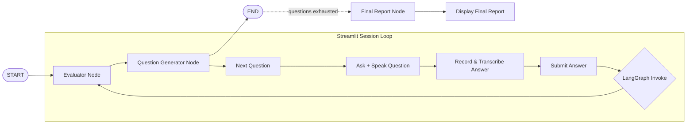

# 🤖 Nova AI Interviewer

**A voice-based mock interview agent that asks questions, listens to your spoken answers, evaluates them in real time, and generates a final performance report — built on LangGraph and Groq.**

[](https://www.python.org/)
[](https://streamlit.io/)
[](https://langchain-ai.github.io/langgraph/)
[](https://groq.com/)
[](LICENSE)

---

## Overview

Nova AI Interviewer simulates a real technical interview end-to-end: it generates role- and difficulty-specific questions, listens to your **spoken** answers through the microphone, transcribes them, evaluates each answer against a rubric, and adapts the next question based on how you performed — before producing a consolidated final report at the end of the session.

It's built as a small **agentic pipeline** rather than a single prompt: an evaluator node scores each answer, and a question-generator node uses that context to decide what to ask next, with LangGraph coordinating the flow and Streamlit driving the UI and session state.

## Features

- 🎙️ **Voice-first interview flow** — record your answer with your mic; no typing required
- 🗣️ **Text-to-speech questions** — Nova reads each question aloud before you answer
- 📝 **Automatic transcription** — spoken answers are converted to text via Faster-Whisper
- 🧠 **LangGraph-orchestrated agent** — an `Evaluator` node and a `Question Generator` node run as a graph, so each new question is informed by the previous answer
- 📊 **Per-question evaluation** — every answer gets a score, strengths, weaknesses, and feedback
- 📄 **Final interview report** — an overall score, technical skill and communication assessment, and a hiring recommendation once the interview ends
- ⚙️ **Configurable sessions** — set the job role, difficulty (Beginner / Intermediate / Advanced), and number of questions before you start
- ⚡ **Groq-powered inference** — low-latency LLM calls for a responsive, real-time feel

## How It Works

1. You configure the interview (role, difficulty, number of questions) in the sidebar and hit **Start Interview**.
2. Nova asks the first question out loud and displays it on screen.
3. You record your answer; it's transcribed automatically and submitted.
4. The **Evaluator** node scores your answer and adds feedback to the session state.
5. The **Question Generator** node reads that state and generates the next question, tailored to your role, difficulty, and prior response.
6. Steps 2–5 repeat until the configured number of questions is reached.
7. A **Final Report** node synthesizes every question, answer, and evaluation into an overall verdict.



## Tech Stack

| Layer | Technology |
|---|---|
| UI | Streamlit |
| Agent Orchestration | LangGraph |
| LLM Provider | Groq (via `langchain-groq`) |
| Speech-to-Text | Faster-Whisper |
| Text-to-Speech | Kokoro / gTTS |
| Audio Capture | `sounddevice`, `streamlit_mic_recorder` |
| Embeddings / Retrieval (available) | `sentence-transformers`, FAISS |
| Language | Python |

## Project Structure

```
Nova-Ai-Interviewer/
├── app.py                          # Streamlit entrypoint — UI, session state, interview loop
├── requirements.txt
├── LICENSE
├── .env                            # API keys (not committed)
└── src/
    ├── Graph/
    │   └── graph.py                # LangGraph StateGraph: Evaluator -> Question Generator
    ├── Node/
    │   ├── evaluator_node.py       # Scores each answer against a rubric
    │   ├── question_genration_node.py  # Generates the next interview question
    │   └── final_report_node.py    # Synthesizes the full session into a final verdict
    ├── State/
    │   └── state.py                # Shared LangGraph State schema
    ├── LLMs/
    │   └── GroqLLm.py              # Groq LLM client wrapper
    └── voice_tools/
        ├── voice_recorder.py       # Microphone recording
        ├── text_to_speech.py       # Speaks questions aloud
        └── speech_to_text.py       # Transcribes recorded answers
```

## Getting Started

### Prerequisites

- Python 3.10+
- A [Groq API key](https://console.groq.com/)
- A working microphone (for voice input)

### Installation

```bash
# Clone the repo
git clone https://github.com/shubh9165/Nova-Ai-Interviewer.git
cd Nova-Ai-Interviewer

# Create a virtual environment
python -m venv venv
source venv/bin/activate      # Windows: venv\Scripts\activate

# Install dependencies
pip install -r requirements.txt
```

### Configuration

Create a `.env` file in the project root:

```env
GROQ_API_KEY=your_groq_api_key_here
HF_TOKEN=your_huggingface_token_here
LANGCHAIN_API_KEY=your_langsmith_api_key_here   # optional, for tracing
LANGCHAIN_PROJECT=your_project_name             # optional, for tracing
```

> ⚠️ Never commit your `.env` file. Make sure `.env` is listed in `.gitignore` before pushing.

### Run the App

```bash
streamlit run app.py
```

Then open the local URL Streamlit prints (typically `http://localhost:8501`) in your browser.

## Usage

1. In the sidebar, enter the **Job Role** (e.g. "AI/ML Engineer"), pick a **Difficulty**, and set the **Number of Questions**.
2. Click **Start Interview**.
3. Listen to each question, record your spoken answer, and click **Submit Answer**.
4. Track your progress and latest evaluation in the "Interview Progress" panel.
5. After the final question, review your full **Final Interview Report**.

## Roadmap

- [ ] Persist interview sessions and reports (export to PDF)
- [ ] Support multiple LLM providers as fallbacks
- [ ] Add topic-specific question banks (DSA, System Design, Behavioral)
- [ ] Deploy a hosted demo

## Contributing

Contributions, issues, and feature requests are welcome. Feel free to open an issue or submit a PR.

## License

This project is licensed under the [MIT License](LICENSE).

---

Built by [Shubh Patel](https://github.com/shubh9165)
